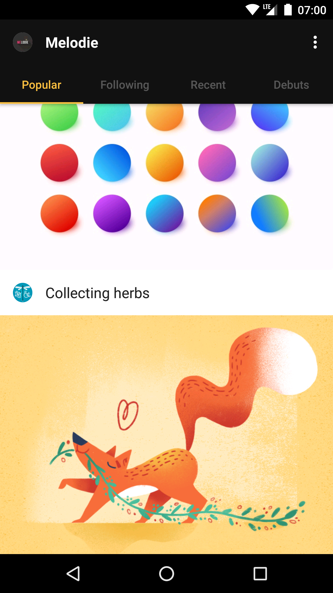
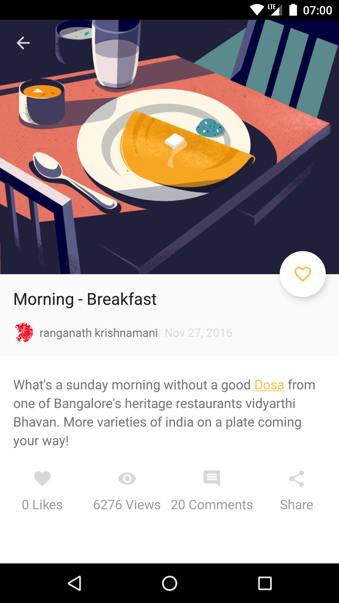
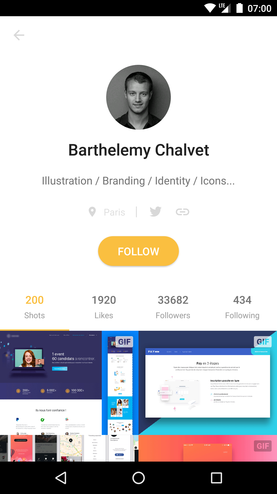
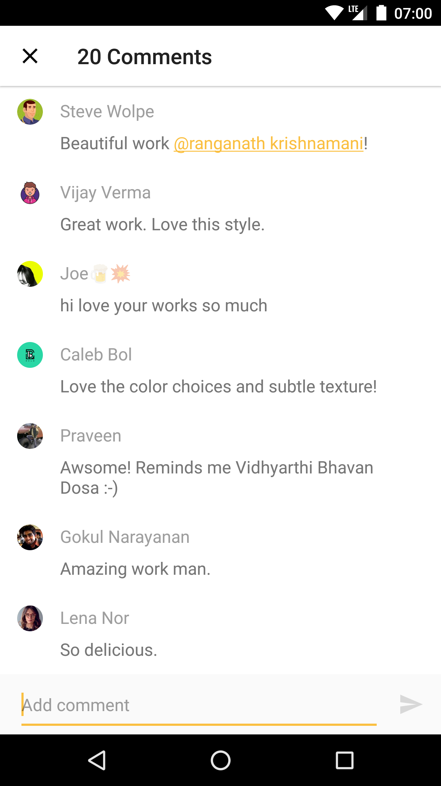

# Protein
Protein is an Android App for [Dribbble](https://dribbble.com/). It is fully open sourced but also published on Google Play (coming soon). 
You can discuss how-tos and best practices on creating an Android App around Protein. 

## Highlights
- Material Design: Not a typical Material Design App, but you will find some familiar elements in Protein.
- MVP architecture: Whole project is built on MVP. Views are implemented by custom views and fragments with activity being
pure container.
- RxJava: Model layer supported by RxJava. Also compose activity and fragment's lifecycles.
- Auto Value: Auto valued all the models to gain some benefits.
- Configuration change: Handles configuration changes like a charm.
- Firebase: Firebase Analytics integrated. Only configured for product flavor play.
- Stetho: Better debug.
- Deep link: Showcase deep link mechanism with [ShotActivity](https://github.com/gejiaheng/Protein/blob/master/app/src/main/java/com/ge/protein/shot/ShotActivity.java), empowers your native App.
- Test: Yes, a few UI tests. More coming, still working on this.

## Screenshots
| Main | Shot | User | Comment |
|:----:|:----:|:----:|:-------:|
| |  | | 

## Build
### Get Started
```shell
./gradlew installOpenDebug
```

### Product Flavors
- open: For open source purpose, use this flavor to develop and debug.
- play: For Google Play publish, maintained by Jiaheng Ge (gejiaheng@gmail.com).

### Dribbble OAuth
Dribbble API client id, client secret and client access token for flavor open are placed in *dribbble_config_open.properties*.
The property file for flavor play is not committed to git.  

You may come across API rate limiting according to [Rate Limiting](http://developer.dribbble.com/v1/#rate-limiting). I suggest you 
register a dribbble application [here](http://developer.dribbble.com/) if you want to develop continually. 
As for *Callback URL*, you can use *x-protein-oauth-dribbble://callback* as default. Or you can define your own url, 
and modify relative constants in [ApiConstants.java](https://github.com/gejiaheng/Protein/blob/master/app/src/main/java/com/ge/protein/data/api/ApiConstants.java).

## Distribute
Protein is published on Google Play (coming soon). The distribution is maintained by Jiaheng Ge (gejiaheng@gmail.com). Every one who contributes
will be on a contributor list in the App.

## Contribute
[Protein is an Open Source Project](https://github.com/gejiaheng/Protein/blob/master/CONTRIBUTING.md)

## License
    Copyright 2017 Jiaheng Ge

    Licensed under the Apache License, Version 2.0 (the "License");
    you may not use this file except in compliance with the License.
    You may obtain a copy of the License at

       http://www.apache.org/licenses/LICENSE-2.0

    Unless required by applicable law or agreed to in writing, software
    distributed under the License is distributed on an "AS IS" BASIS,
    WITHOUT WARRANTIES OR CONDITIONS OF ANY KIND, either express or implied.
    See the License for the specific language governing permissions and
    limitations under the License.
